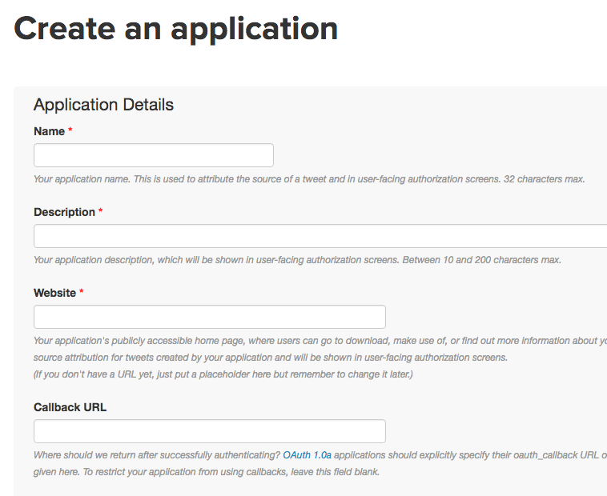
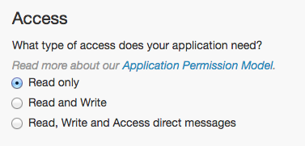
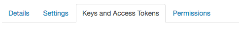
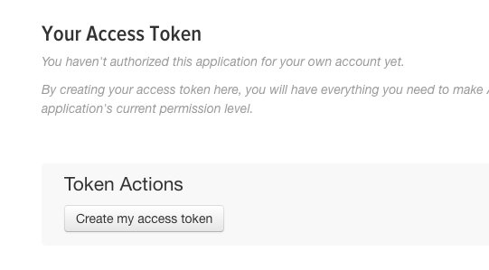
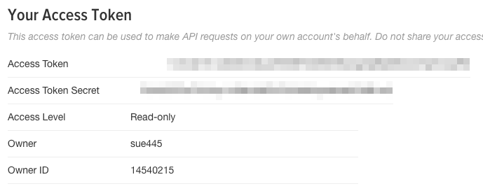
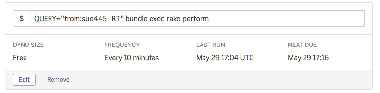

# 1. Register twitter app and get tokens
## 1.1. Go to https://apps.twitter.com/app/new and create app



* **Callback URL** is not needless

## 1.2. Go to ***Permissions*** and update Access level to ***Read only***



## 1.3. Go to ***Keys and Access Tokens*** and ***Create my access token***




## 1.4. Don't forget tokens :memo:
* Consumer Key (API Key)
* Consumer Secret (API Secret)
* Access Token
* Access Token Secret




# 2. Register mastodon app and get tokens
## 2.1. Create mastodon app
```bash
$ MASTODON_URL=https://mastodon.example.com
$ CLIENT_NAME="Your App Name"
$ WEBSITE_URL=https://example.com/

$ curl -X POST -d "client_name=$CLIENT_NAME&redirect_uris=${REDIRECT_URIS:-urn:ietf:wg:oauth:2.0:oob}&scopes=${SCOPES:-read write}&website=$WEBSITE_URL" $MASTODON_URL/api/v1/apps
{"id":000,"redirect_uri":"urn:ietf:wg:oauth:2.0:oob","client_id":"XXXXXXXXXXXXXXXXX","client_secret":"XXXXXXXXXXXXXXXXX"}
```

## 2.2. Don't forget tokens :memo:
* `client_id`
* `client_secret`

## 2.3 Register your account to app
```bash
$ CLIENT_ID=XXXXXXXXXXXXXXXXX
$ CLIENT_SECRET=XXXXXXXXXXXXXXXXX
$ YOUR_EMAIL=you@example.com
$ YOUR_PASSWORD=XXXXXXXXXXXXXXXXX

$ curl -X POST -d "client_id=$CLIENT_ID&client_secret=$CLIENT_SECRET&grant_type=password&username=$YOUR_EMAIL&password=$YOUR_PASSWORD&scope=${SCOPES:-read write}" -sS $MASTODON_URL/oauth/token
{"access_token":"XXXXXXXXXXXXXXXXX","token_type":"bearer","scope":"read write","created_at":0000000000}
```

## 2.4. Don't forget token :memo:
* `access_token`

# 3. Deploy to Heroku 
[](https://heroku.com/deploy)

# 4. Register to Heroku scheduler
Register `QUERY="TWITTER_SEATCH_QUERY" bundle exec rake perform`

Example


